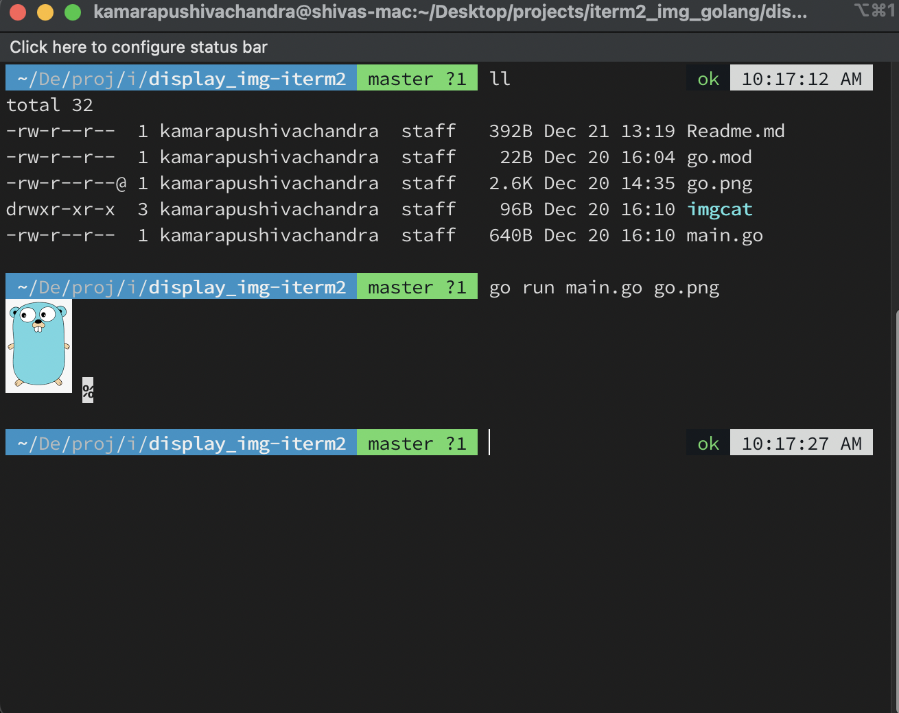

# iterm2 image display

```markdown
Displaying img passed in command line arguments in te terminal

  https://iterm2.com/documentation-images.html

  1.  go run main.go imgName.png
  2.  Golang will display image in iterm2(header + base64(imgContent) + footer)

  this project helps u understand io.pipes() in depth
  final code in master branch
  different branches are made while improving code quality (from start to end)
```

